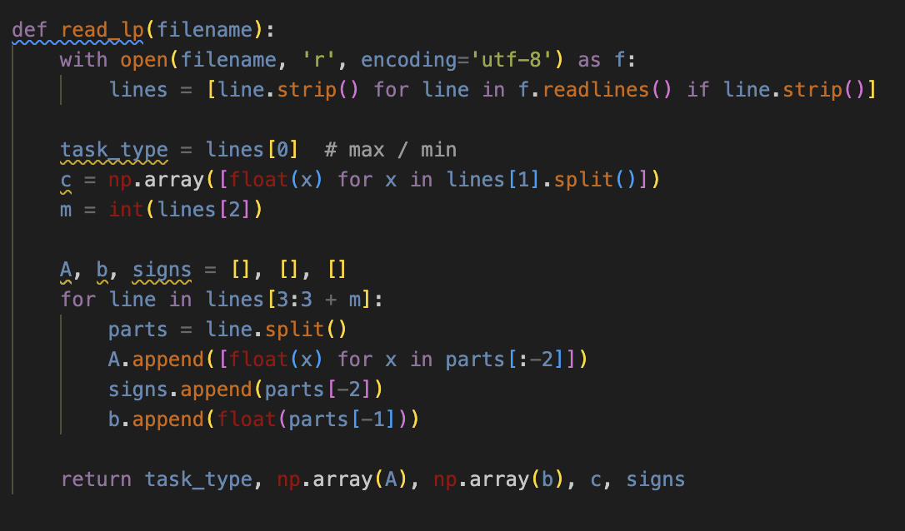
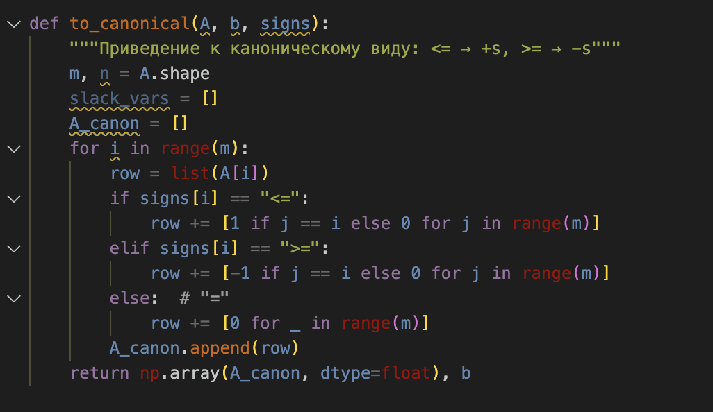
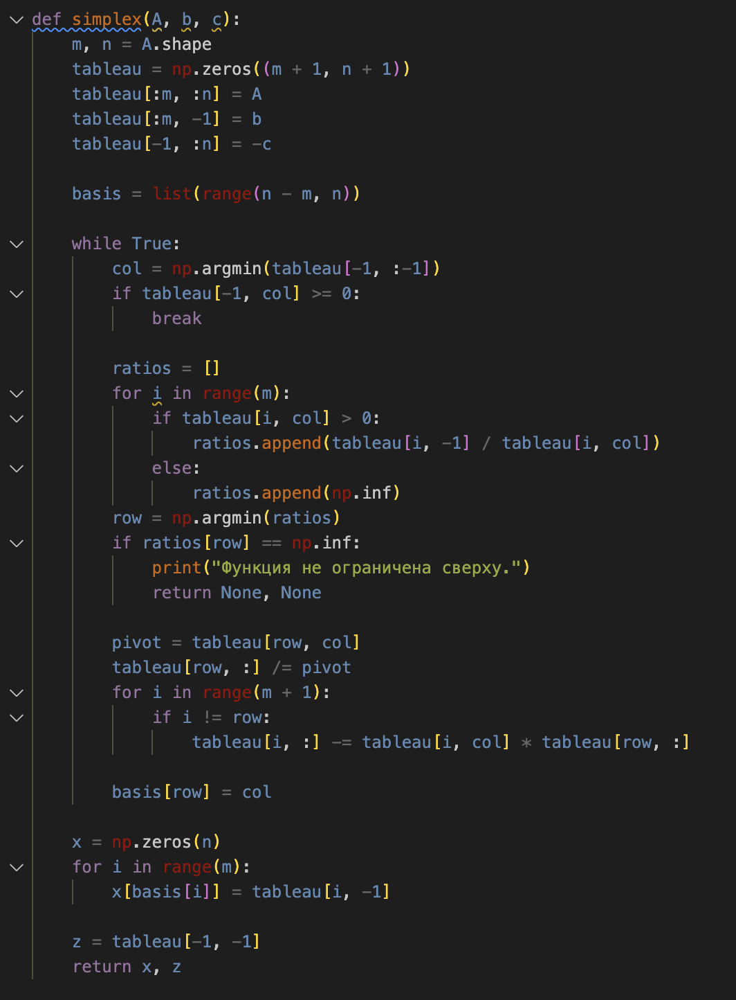
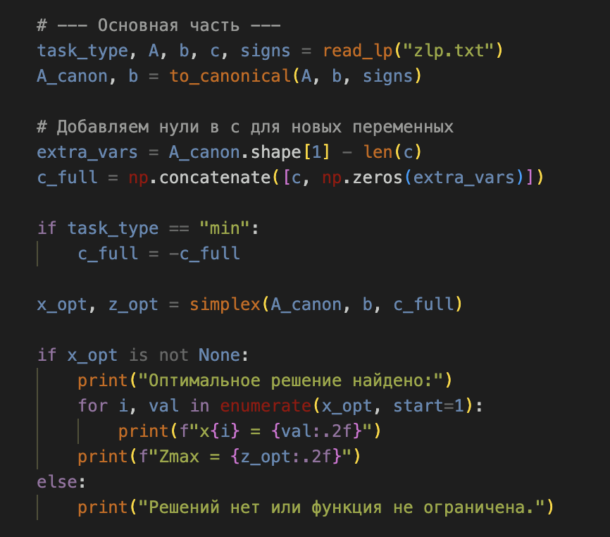

## Автор
- Мельникова Настасья Филипповна
- Факультет прикладной информатики, ИТМО
- Лабораторная работа по дисциплине «Методы оптимизации» (вариант 9), поток 1.1
- Преподаватель: Духанов А.В.

# Решение задачи линейного программирования симплекс-методом

## Описание задачи
Данный код реализует **симплекс-метод** решения задачи линейного программирования (ЗЛП) **без использования специализированных библиотек оптимизации**.  
Программа полностью выполняет цикл:  
- считывание задачи из текстового файла,  
- приведение к каноническому виду,  
- построение симплекс-таблицы,  
- итерационное решение,  
- вывод оптимальной точки и значения целевой функции.

---

  

---

## Формат входных данных
Исходные данные задаются в текстовом файле `input.txt` следующего вида:
```bash
max
2 1 3 2
3
1 2 1 0 <= 11
1 0 1 1 = 8
0 1 0 1 >= 3
```

где:
- первая строка — направление оптимизации (`max` или `min`);
- вторая — коэффициенты целевой функции;
- третья — количество ограничений;
- далее — ограничения в виде: коэффициенты, знак (`<=`, `>=`, `=`) и правая часть.

---

## Алгоритм работы программы
Решение задачи выполняется поэтапно:

1. **Считывание данных из файла** (`read_lp(filename)`):  
   парсинг данных, извлечение коэффициентов и знаков ограничений.
   
   *Рис. 1. функция read\_lp в коде.*
   Функция предназначена для считывания исходных данных из текстового файла (например, zlp.txt). Формат входного файла включает:
   • направление оптимизации (max или min);
   • коэффициенты целевой функции;
   • количество ограничений;
   • коэффициенты ограничений, знаки (≤, ≥, =) и правые части.
   В результате функция возвращает направление задачи, матрицу коэффициентов A, вектор правых частей b, вектор коэффициентов целевой функции c, а также список знаков неравенств.

3. **Приведение задачи к каноническому виду** (`to_canonical(A, b, signs)`):  
   добавление дополнительных переменных для перехода от неравенств к равенствам.
   
   *Рис. 2. функция to_canonical в коде.*
   Функция выполняет приведение задачи к каноническому виду. Для этого все 3 неравенства преобразуются в равенства с добавлением дополнительных (запасных) переменных.
   Если знак неравенства противоположный (≥), добавляется переменная с отрицательным знаком. На выходе формируются новая матрица A′ и вектор b′, пригодные для построения симплекс-таблицы.
   
5. **Построение и решение симплекс-таблицы** (`simplex(A, b, c)`):  
   итеративный выбор разрешающего элемента, нормализация строк и обновление базиса.
   
   *Рис. 3. функция simplex в коде.*
   Основная вычислительная функция, реализующая симплекс-метод. На вход подаются:
   • матрица коэффициентов ограничений A;
   • вектор правых частей b;
   • вектор коэффициентов целевой функции c.
   На их основе формируется симплекс-таблица, где последняя строка содержит коэффициенты функции цели. Алгоритм итерационно выполняет:
   (a) выбор разрешающего столбца (наиболее отрицательный элемент в строке цели);
   (b) выбор разрешающей строки (по минимальному положительному отношению bi/aij );
   (c) нормализацию разрешающей строки и пересчёт остальных строк;
   (d) обновление базиса переменных.
   Процесс продолжается до тех пор, пока в строке цели не останется отрицательных элементов, что соответствует достижению оптимального решения.
   На выходе функция возвращает вектор найденных значений переменных и оптимальное значение целевой функции Zmax. .
7. **Вывод результата в консоль**:  
   отображение найденных значений переменных и максимального значения целевой функции.
   
   *Рис. 4. основная часть кода.*
   Основная часть программы объединяет все этапы работы алгоритма:
   • считывает данные из текстового файла zlp.txt;
   • вызывает функцию приведения задачи к каноническому виду;
   • формирует симплекс-таблицу и выполняет симплекс-итерации;
   • отображает результат в консоли в читаемом виде.
---

## Пример вывода
Оптимальное решение найдено:
```bash
x1 = 0.00
x2 = 1.50
x3 = 8.00
x4 = 0.00
Zmax = 25.50
```
Таким образом, реализованный программный код выполняет полный цикл решения задачи линейного программирования — от ввода исходных данных до полученияоптимальной точки и значения целевой функции.
---
## Вывод
В ходе выполнения данной лабораторной работы я разработала и протестировала программу для решения задач линейного программирования с помощью симплекс-метода. 
Все вычисления и логика реализованы вручную, без использования специализированных библиотек оптимизации (scipy, pulp и др.). Программа построена так, что каждый шаг алгоритма полностью соответствует ручному выполнению симплекс-метода — построению таблицы, выбору разрешающего элемента и последовательному пересчёту строк.
Наиболее полезной частью работы стало то, что я наконец разобралась, как симплекс-метод работает изнутри, а не просто по формулам из учебника. При ручной реализации алгоритма становится ясно, почему выбирается именно тот столбец, что означает базис, как изменяется целевая функция и что происходит при каждой итерации.
В процессе работы возникали трудности, в основном связанные с отладкой индексов и базисных переменных. Если перепутать, какая переменная входит или выходит из базиса, таблица быстро теряет корректность, и приходится искать ошибку пошагово. Однако именно через такие моменты удалось глубже понять внутреннюю механику метода и научиться видеть логические ошибки в рассуждениях, а не только синтаксические. В целом, работа получилась действительно полезной. Я не только освоила принцип работы симплекс-метода, но и научилась программно реализовывать его шаги,
что помогло лучше понять взаимосвязь между математическим описанием задачи и её практической реализацией в коде. Программа получилась универсальной — онаспособна обрабатывать задачи с любыми типами ограничений, считывать данные из файла и наглядно демонстрировать пошаговое решение.

## Запуск программы
Для запуска достаточно скачать код lab1.py и ввести в терминал:
```bash
python lab1.py


