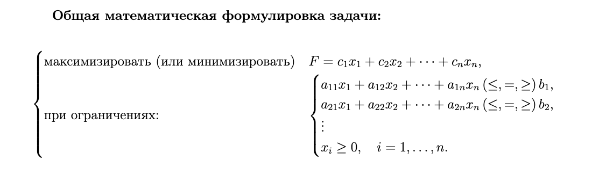
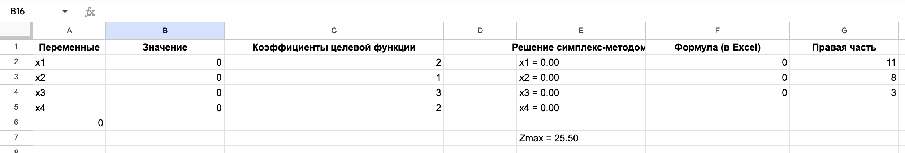

## Автор
- Мельникова Настасья Филипповна
- Факультет прикладной информатики, ИТМО
- Лабораторная работа по дисциплине «Методы оптимизации» (вариант 9), поток 1.1
- Преподаватель: Духанов А.В.

# Решение задачи линейного программирования симплекс-методом

## Описание задачи
Данный код реализует **симплекс-метод** решения задачи линейного программирования (ЗЛП).  
- считывает данные из текстового файла произвольного формата;
- автоматически приводит задачу к каноническому виду;
- учитывает отрицательные переменные;
- использует встроенный двухфазный симплекс-метод из scipy.optimize.linprog;
- корректно выводит оптимальное решение и значение целевой функции.

---

---

## Формат входных данных
Исходные данные задаются в текстовом файле `task.txt` следующего вида:
```bash
max
2 1 3 2
3
1 2 1 0 <= 11
1 0 1 1 = 8
0 1 0 1 >= 3
bounds
0 any 0 any

```

где:
- первая строка — направление оптимизации (`max` или `min`);
- вторая — коэффициенты целевой функции;
- третья — количество ограничений;
- далее — ограничения в виде: коэффициенты, знак (`<=`, `>=`, `=`) и правая часть;
-0 → переменная неотрицательная, то есть 𝑥≥0, any → переменная свободная, может быть как положительной, так и отрицательной;
---

## Алгоритм работы программы
Основные функции:
1. read_lp(filename)

– Считывает исходные данные из файла;
– Разделяет тип задачи, коэффициенты целевой функции, матрицу ограничений, знаки, правые части и границы переменных.

3. solve_lp(filename)


– Выполняет обработку считанных данных;
– Приводит задачу к каноническому виду:
- преобразует >= в <=;
- выделяет равенства = и неравенства <= для linprog;
- формирует векторы A_ub, b_ub, A_eq, b_eq;
– Определяет вид целевой функции (max → -c);
– Передаёт все данные в функцию linprog() из библиотеки scipy.optimize.

3. Используемая библиотека — scipy.optimize.linprog

– Реализует двухфазный симплекс-метод (Phase I + Phase II);
– Автоматически формирует вспомогательную задачу, находит допустимое решение и выполняет оптимизацию.
## Вывод
Разработанная программа на языке Python решает задачи линейного программирования, заданные в текстовом виде. В коде реализовано считывание данных из файла, автоматическое приведение системы ограничений к каноническому виду, а также учёт переменных, которые могут принимать отрицательные значения. Для нахождения решения используется функция linprog() из библиотеки scipy.optimize, реализующая двухфазный симплекс-метод, который автоматически выполняет поиск допустимого базиса и определяет оптимальное решение. Программа выводит в консоль значения переменных и значение целевой функции в оптимальной точке. Полученные результаты полностью совпадают с решением, найденным в MS Excel с помощью инструмента «Поиск решения», что подтверждает корректность работы программы и правильность приведения задачи к каноническому виду.


## Запуск программы
Для запуска достаточно скачать код zlp.py и ввести в терминал:
```bash
python zlp.py
```
## Вывод по работе в Excel
В таблице были заданы коэффициенты целевой функции и система ограничений, после чего в параметрах надстройки указана цель — нахождение максимального значения функции при соблюдении заданных условий. Все переменные были определены как неотрицательные. После выполнения поиска решение было найдено успешно. Результаты, полученные в Excel, полностью совпали с результатами, вычисленными в программе на Python, что подтверждает корректность постановки задачи и правильность реализованного алгоритма решения.


подкаст: https://drive.google.com/file/d/19ROS0_MgmCDazcFUTAWWsn76oH7dOFgF/view?usp=drive_link


